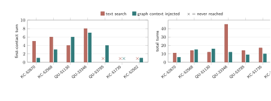

# Ablation Study Evidence

Complete evidence for the paper's ablation study (Section "How the Graph
Reaches the Agent"): seven multi-hop issue-fix tasks mined from Keycloak and
Quarkus, solved by the same model under different delivery conditions.
Every number in the section regenerates from `results.jsonl`; `MANIFEST.sha256`
covers every file in this folder.

## Headline figure

Left: the turn at which the agent first touches a file the real fix changed;
a colored x marks runs that never reached one. Right: total turns to finish.
Regenerates from `results.jsonl`.

## Tasks

| Paper ID | Upstream issue |
|---|---|
| KC-51735 | https://github.com/keycloak/keycloak/issues/51735 |
| KC-52502 | https://github.com/keycloak/keycloak/issues/52502 |
| KC-52568 | https://github.com/keycloak/keycloak/issues/52568 |
| KC-52670 | https://github.com/keycloak/keycloak/issues/52670 |
| QU-33346 | https://github.com/quarkusio/quarkus/issues/33346 |
| QU-51130 | https://github.com/quarkusio/quarkus/issues/51130 |
| QU-53785 | https://github.com/quarkusio/quarkus/issues/53785 |

## Layout

- `TASKS.txt` — every task directory mapped to its upstream public issue URL.
- `figures/` — the rendered arms chart (SVG).
- `results.jsonl` — one record per (task, arm) run: gold hit, first-gold turn,
  turns, tokens, cost, CLI query count. Authoritative source for the section.
- `FINAL-TABLE.txt` — the same records rendered as a table.
- `GRAPH-CORRECT-CENSUS.txt` — per-task verification that the engine's chains
  match the ground-truth call chains.
- `tasks/<project>-<issue>/` — per-task evidence:
  - `gold.txt` — files changed by the maintainers' fix (the oracle).
  - `impact-*.txt`, `link-path-*.txt`, `proof-*.txt` — the engine's graph-query
    outputs used to build the injected context.
  - `results.json` — per-task roll-up.
  - one subfolder per arm with the full agent transcript (`stream.jsonl`) and
    the patch the agent produced.
- `baselines/`, `baselines-53785/`, `baselines-ext/` — the four baseline
  builders run on the same sources: build logs and raw query outputs per tool
  per task (24 tool-task cells).
- `blind/gen_blind_brief.py` — the mechanical recipe that generates injected
  briefs from issue text alone, without access to the gold files.

## Arm names

- `d19-raw` — text search only (no graph).
- `d19b-brief` — graph context injected (the paper's injected arm; the brief
  is generated blind and included verbatim in each transcript's prompt).
- `d19-two` — graph exposed as a live CLI tool the agent must query.
- `d19f-two`, `d19v2-two` — earlier injected-prompt variants, retained for
  completeness; the paper reports `d19-raw` and `d19b-brief`.

Integrity note: `stream_sha256` values inside `results.jsonl` were computed on
the pre-anonymization transcripts; `MANIFEST.sha256` is authoritative for the
files shipped here.
