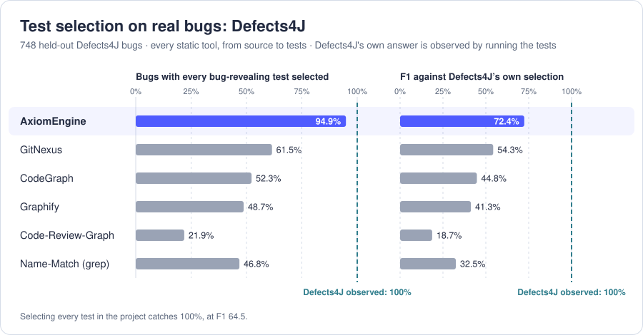
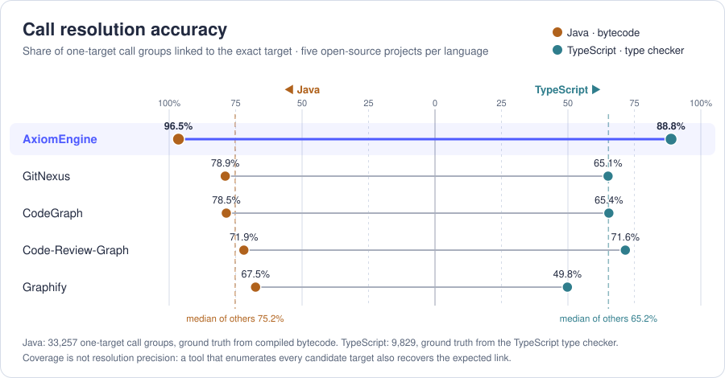

<p align="center">
  
</p>

<h1 align="center">AxiomEngine Graph</h1>

<p align="center">
  <strong>A god's-eye view of your codebase for AI agents. Stop grepping. Ensure correctness and completeness for any task your AI agent performs.</strong>
</p>

<p align="center">
  
  &nbsp;&nbsp;&nbsp;
  
  &nbsp;&nbsp;&nbsp;
  
  &nbsp;&nbsp;&nbsp;
  
  &nbsp;&nbsp;&nbsp;
  
  &nbsp;&nbsp;&nbsp;&nbsp;&nbsp;&nbsp;
  
  &nbsp;&nbsp;
  
  &nbsp;&nbsp;
  
</p>

<p align="center">
  <a href="#what-it-does">What it does</a> ·
  <a href="#why-axiomengine-graph">Why</a> ·
  <a href="#get-started">Get started</a> ·
  <a href="#language-and-skill-maturity">Maturity</a> ·
  <a href="#benchmark-results">Benchmarks</a> ·
  <a href="#cli-commands">CLI</a> ·
  <a href="#graph-output">Graph output</a> ·
  <a href="#measured-cross-file-coverage">Cross-file coverage</a> ·
  <a href="#how-to-run-locally">Run locally</a>
</p>

<p align="center">
  <a href="ANONYMIZED-URL/actions/workflows/ci.yml"></a>
  <a href="https://www.npmjs.com/package/@axiomengine/code-graph"></a>
  <a href="ANONYMIZED-URL/actions/workflows/nightly.yml"></a>
  <a href="LICENSE.md"></a>
  
</p>

<p align="center">
  <b>Be first to see what we build.</b> &nbsp;<a href="https://anonymized.example/updates"><b>Stay in touch ↗</b></a>
</p>

---

## What it does

Give it a repository. It builds a knowledge graph of your code using formal methods: for every function, exactly
who calls it and what it calls, derived by logical rules rather than guessed. Your AI agents, and you, then
understand, explore, search and edit the code from that map instead of grepping. Grep cannot see calls through an
interface, a subclass or a callback, and its output gets truncated, so agents silently miss what was cut. The map
prunes 99.9% of the codebase, so agents keep their context for the task, not the search.

<p align="center">
  
</p>

**On real bugs.** On 748 held-out [Defects4J](https://github.com/rjust/defects4j) bugs, scored once after the rules
were frozen, the tests AxiomEngine picks from source include every bug-revealing test for **94.9%** of bugs (best
tree-sitter builder: 61.5%), at an **F1 of 72.4** against what Defects4J observes by running the suite.

**Why: types make a better graph.** Choosing tests means following calls several hops back from a change, and one
wrong link loses every test beyond it. A tree-sitter based CST builder matches a call to a declaration by name;
AxiomEngine resolves it the way the compiler does, from the receiver's type. Scored against the compiler's own answer,
compiled bytecode for Java and the type checker for TypeScript, over five open-source projects per language:

| share of calls linked to their exact target | **AxiomEngine** | GitNexus | CodeGraph | Code-Review-Graph | Graphify |
|---|---:|---:|---:|---:|---:|
| Java, 33,257 calls (bytecode) | **96.5%** | 78.9% | 78.5% | 71.9% | 67.5% |
| TypeScript, 9,829 calls (type checker) | **88.8%** | 65.1% | 65.4% | 71.6% | 49.8% |

**Across files**, it recovers which files call into which with an F1 of **0.976** in Java and **0.896** in
TypeScript (best CST-based: 0.876 and 0.708), and finds the call path from one method to another **97.4%** and
**87.7%** of the time (80.6% and 65.8%).

AxiomEngine supports **Java, TypeScript and Python**, with **JavaScript and C#** in beta
([Language and skill maturity](#language-and-skill-maturity)). These benchmarks are Java and TypeScript, the
languages where a compiler gives an independent ground truth to score against. Details in
[Benchmark results](#benchmark-results) and [Measured cross-file coverage](#measured-cross-file-coverage).

## Why AxiomEngine Graph?

**A typed graph is a more accurate graph.** Compared with a tree-sitter-based graph builder, which guesses a call's
target from syntax (the name, the imports, a variable's declared type), AxiomEngine resolves each call from the
receiver's declared and inferred type, as the compiler does. Through an interface, an override, a generic, or a
callback, syntax alone cannot decide the target, and every wrong guess is a missing or invented edge; a resolved
edge is a call the program actually makes.
That matters because an agent follows edges several hops deep, and one missed link loses everything beyond it.

<p align="center">
  
</p>

*`axiomengine graph` on an open-source TypeScript web framework, asked which tests a change to `basicAuth` can
affect. Source files form the inner ring and test files the outer one. The solid blue paths are chains of resolved
calls from `basicAuth` to the 7 test files that must run; the dashed red ones mark the other 130, which have no
chain to it and can be skipped. Green is the shared `compare` that `basicAuth` calls, and gold the 11 other files
that also reach it.*

AI agents work from an incomplete picture of a codebase, and the reason is structural: what a call reaches is
usually decided somewhere else. The type comes from another file, the implementation from another module, the
binding from a dependency or a configuration key. Reading the file in front of you cannot show any of that, so a
missed dependency becomes an incomplete change and a second fix.

AxiomEngine Graph makes the structure behind the code queryable. Agents can understand a task's scope, from the
implementation to downstream effects and affected tests, before acting. This supports more reliable changes, more
complete task execution, and up to 50% fewer tool calls to explore a new codebase in our benchmarks.

The graph is grounded in formal methods, using deterministic, language-aware rules. Source locations and confidence
tiers make its results inspectable, while unresolved calls remain explicit rather than being presented as
established relationships that could lead to false positives.

## Get Started

AxiomEngine Graph is two parts. The **engine** (`@axiomengine/code-graph` on npm) parses a repository and builds its
graph; it also provides the `axiomengine` command and an MCP server. The **plugin** (`plugins/axiomengine/`) is the
agent-facing frontend: a skill, seven MCP tools, and hooks. Install the engine first.

Requirements: **Node ≥ 22.5** and **Python 3** (`python3`, or `python` / `py` on Windows). On Windows, also
[Git for Windows](https://git-scm.com/download/win): the CLI runs under its bash. The engine ships as a prebuilt
binary for macOS (Apple Silicon and Intel), Linux (x64 and arm64) and Windows x64, and `npm install` takes the one for
your platform. No Soufflé and no compiler are needed, with one exception:

> **Linux arm64** (Graviton or Ampere servers, Raspberry Pi, `node:*-slim` or Alpine containers on an Apple Silicon
> Mac): the parser's native modules compile during `npm install`, so install build tools first, e.g.
> `sudo apt install build-essential python3`. The full `node:*` Docker images already include them.

Before every release, the exact packages that ship are installed without Soufflé and run end to end (every CLI verb,
five languages) on macOS arm64 and x64, Linux x64 and arm64, and Windows x64. Check an install with
`axiomengine --version`.

### Installation

```bash
# 1. the engine and the axiomengine command
npm i -g @axiomengine/code-graph

# 2. the plugin, in your agent
# Claude Code
claude plugin marketplace add anonymous-org/axiomengine && claude plugin install axiomengine@axiomengine
# Codex CLI and desktop app
codex plugin marketplace add anonymous-org/axiomengine && codex plugin add axiomengine@axiomengine
# Copilot CLI (VS Code agent mode loads Copilot CLI's plugins too)
copilot plugin marketplace add anonymous-org/axiomengine && copilot plugin install axiomengine@axiomengine
# Gemini CLI
gemini extensions install ANONYMIZED-URL
# Cursor
cursor-agent plugin marketplace add ANONYMIZED-URL
# Windsurf, Devin CLI
devin plugins install anonymous-org/axiomengine#plugins/axiomengine
```

Any other agent that speaks MCP takes one entry in its MCP config; see
[Support for agents](#support-for-agents). Start a new agent session afterward: plugins are loaded at startup.
Add `.axiomengine/` to your `.gitignore`; the graph is built there on first use.

### Uninstallation

```bash
# 1. the plugin, in your agent
# Claude Code
claude plugin uninstall axiomengine@axiomengine && claude plugin marketplace remove axiomengine
# Codex CLI
codex plugin remove axiomengine@axiomengine && codex plugin marketplace remove axiomengine
# Copilot CLI
copilot plugin uninstall axiomengine@axiomengine && copilot plugin marketplace remove axiomengine
# Gemini CLI
gemini extensions uninstall axiomengine

# 2. the engine, and the graphs it built
npm uninstall -g @axiomengine/code-graph
rm -rf <your-project>/.axiomengine ~/.cache/axiomengine
```

In Cursor, remove the plugin from the Plugins panel; in Devin CLI, from its plugin manager; in VS Code, take the
repository out of `chat.plugins.marketplaces`; in any other MCP client, delete the `axiomengine` entry.

### Examples

From the shell, in any Java, TypeScript, Python, JavaScript, or C# project. There is no setup step: the first
command builds the graph, and later ones read it.

In this TypeScript project, `main` builds an `OrderService` and calls `place`, which writes to two things in two
other folders: a `Ledger`, a concrete class, and a `Store`, an interface that `SqlStore` and `MemoryStore`
implement. Both chains cross files; the second goes through the interface, where nothing in `orderService.ts`
names `SqlStore`, so searching for it never reaches the caller.

```bash
cd <your-project>
axiomengine path main Ledger.put
axiomengine path main SqlStore.put
```

```
main → Ledger.put: 1 of 1 target(s) reached through resolved calls; nearest at 2 hop(s)
  2 call(s):
    main   src/main.ts:6
      → [known_edge · call @ src/main.ts:9] OrderService.place   src/orders/orderService.ts:7
      → [known_edge · call @ src/orders/orderService.ts:8] Ledger.put   src/ledger/ledger.ts:4
  verified: every printed hop is an edge in the graph and a second, independent traversal finds the same length

main → SqlStore.put: 1 of 1 target(s) reached through resolved calls; nearest at 2 hop(s)
  2 call(s):
    main   src/main.ts:6
      → [known_edge · call @ src/main.ts:9] OrderService.place   src/orders/orderService.ts:7
      → [multi_inferred · call @ src/orders/orderService.ts:9] SqlStore.put   src/storage/sqlStore.ts:6
  verified: every printed hop is an edge in the graph and a second, independent traversal finds the same length
  what the hops are:
    [known_edge] resolved to one declaration
    [multi_inferred] several declarations fit; each is a real candidate
```

The first chain is `known_edge` all the way: each call has exactly one target. The second ends in
`multi_inferred`, because `store.put` can run `SqlStore.put` or `MemoryStore.put`, depending on which store `main`
built; the graph keeps both as candidates instead of picking one.

From an agent, ask in plain words. The skill tells the agent to query the graph instead of grepping:

```
> What breaks if I change SqlStore.put?

  axiomengine_impact("SqlStore.put")
  must change with it (1: bound by a contract the engine resolved):
      Store.put   src/storage/store.ts:2   — it implements this
  reads or uses it (3 callable(s): 1 one of a set, 2 alongside):
      [one of a set] OrderService.place   src/orders/orderService.ts:9   — calls it
      ...
  reaches those through resolved calls: 4 more callable(s) in 3 file(s)
      src/main.ts: main → OrderService.place
  tests: 1 of 1 test method(s) reach the change
      test files: test/orderService.test.ts (1)
  verified: 2 printed edge(s) looked up again in the graph, all present
```

The change reaches the entry point and the test through a call that never names `SqlStore`.

Each hop carries the line the call is on, how certain the edge is, and what kind of call it is. Every printed
edge is looked up again in the graph before you see it; the `verified:` line is that check reporting.

### Support for agents

Every agent below gets the seven MCP tools and the skill; the hooks, which add the graph's edges to the agent's
own file reads and searches, run where the last column says so.

| Agent | Install | Uninstall | Hooks |
|---|---|---|---|
| **Claude Code** | `claude plugin marketplace add anonymous-org/axiomengine` then `claude plugin install axiomengine@axiomengine` | `claude plugin uninstall axiomengine@axiomengine` | yes |
| **Codex CLI** and desktop app | `codex plugin marketplace add anonymous-org/axiomengine` then `codex plugin add axiomengine@axiomengine` | `codex plugin remove axiomengine@axiomengine` | yes |
| **Copilot CLI** | `copilot plugin marketplace add anonymous-org/axiomengine` then `copilot plugin install axiomengine@axiomengine` | `copilot plugin uninstall axiomengine@axiomengine` | no |
| **VS Code** (Copilot agent mode) | add `"chat.plugins.marketplaces": ["anonymous-org/axiomengine"]` to settings | remove the setting | no |
| **Cursor** | `cursor-agent plugin marketplace add ANONYMIZED-URL` | the Plugins panel | yes |
| **Gemini CLI** | `gemini extensions install ANONYMIZED-URL` | `gemini extensions uninstall axiomengine` | yes |
| **Windsurf**, **Devin CLI** | `devin plugins install anonymous-org/axiomengine#plugins/axiomengine` | Devin's plugin manager | no |
| **Any MCP client** and others | the JSON below in its MCP config | remove the entry | no |

```json
{ "mcpServers": { "axiomengine": { "command": "npx", "args": ["-y", "@axiomengine/code-graph", "mcp"] } } }
```

## Language and skill maturity

A language is usable end to end when both the **parser** (source → relational IR) and the **engine**
(IR → graph) support it. The skill, the MCP tools and the CLI answer from the same graph for every language.

| language | parser | engine | maturity |
|---|---|---|---|
| **Java** | stable | stable | **stable**. Hand-crafted constructs at precision and recall 1.000; Spring/DI wiring and configuration files resolved |
| **TypeScript** | stable | stable | **stable**. Structural typing, overload sets, the module graph, `.d.ts` libraries |
| **Python** | stable | stable | **stable**. MRO, decorators, protocols, dynamic-attribute detection |
| **JavaScript** | stable | beta | **beta**. JSDoc as the type channel, CommonJS and ESM; being scored against the TypeScript compiler |
| **C#** | stable | beta | **beta**. Regression cases, ground truth and a runtime oracle |

XML, YAML, `.properties` and `META-INF/services` are part of the Java graph, so a change to a property key or a
wiring declaration has a blast radius into methods. A repository with several languages gets one graph per
language.

## Benchmark results

**Call resolution.** 96.5% of Java calls and 88.8% of TypeScript calls linked to the compiler's exact target;
the chart above and [Measured cross-file coverage](#measured-cross-file-coverage) break this down.

**Test selection.** On 748 held-out bugs from Defects4J, scored once after the evaluation rules were frozen,
the tests AxiomEngine selects include every bug-revealing test for **94.9%** of bugs, against **61.5%** for the
best CST-based graph builder, at an F1 of **72.4** against Defects4J's own selection, which it gets by
running the suite.

The table is at the [top of this page](#what-it-does).

**Change impact.** On five real commits of a large JVM project (181,355 methods), the direct callers AxiomEngine
reports have precision **0.980** against 0.397 for CST-based name matching, at the same recall. An agent asked
about one change had to read 95 of 43,793 methods, and every true direct caller was among them.

## CLI commands

| command | what it does |
|---|---|
| `axiomengine path <A> <B>` | the chain of calls from A to B, hop by hop. `'*'` as one end gives the whole closure |
| `axiomengine impact <target>` | everything that has to be looked at again when a declaration changes, each labelled with how certain it is. `--tests` adds the tests that reach it |
| `axiomengine test-impact` | which tests have to run for the current edit, with the chain that reaches each |
| `axiomengine changed` | which declarations an edit changed, and how (signature, type, body, added, removed). `--impact` adds what that reaches |
| `axiomengine context "<task>"` | where a task's words land in the code, when you have a problem statement and not yet a name |
| `axiomengine graph` | the whole graph as one self-contained HTML page, at `.axiomengine/graph/graph.html`, drawn from the existing graph (rebuilt first only when stale, with the flags it was indexed with) |
| `axiomengine index` | build or rebuild the graph explicitly; `--lang`, `--src` and `--library` narrow it |
| `axiomengine mcp` | serve the graph to an agent as MCP tools over stdio |

A target is written the way it appears in the code: `Owner.method`, `method`, `Type`, `Owner.field`, or
`file.py:123`. It is resolved exactly; a miss lists the nearest names. `--range <a>..<b>` compares two commits. The
query commands take `--json`. `axiomengine help <command>` prints one command's usage.

> [!NOTE]
> `changed` and `test-impact` compare the working tree with a **baseline**: the last commit (right after an explicit
> `axiomengine index`, the tree it indexed). The background refresh (below) resets it whenever HEAD moves (a commit, a
> merge, a pull, a checkout), so committed edits drop out and nothing accumulates; the two commands wait up to 30 s
> for that. While edits are uncommitted, they read the baseline's own graph, kept in `.axiomengine/base`, so a removed
> method still shows all its callers.

The graph stays current on its own. Every file the parser reads is recorded with its hash at build time; after an
edit, a shell command, a finished turn, at session start, and before a query, anything that differs starts one
background rebuild per repository, with the language, `--src` and `--library` of the graph it replaces. Every
command keeps reading the previous graph until the new one is indexed and swapped in. A query waits up to
`AXIOMENGINE_FRESH_WAIT` seconds (default 10) for it, then answers from the previous graph with a `graph refresh:` line
naming the files it predates. The MCP server also checks every repository it has answered for once 15 minutes have
passed since its last update (`AXIOMENGINE_REFRESH_INTERVAL`, seconds; 0 turns it off), which catches edits made while
a session sits idle. The graph records when and why it was built in `index_meta` (`refreshed_at`, `refresh_reason`).
`AXIOMENGINE_NO_REFRESH=1` turns the rebuilds off, not the check: an answer from a graph older than an edit still
ends with a `graph refresh: OFF` line naming the files it predates. When a name asked about finds nothing and an
edit since the graph was built writes that name, the line says so, since the declaration may simply be too new
for the graph. The log is `.axiomengine/refresh.log`.

## Graph output

The graph is one SQLite database, `.axiomengine/out/graph.sqlite`, with the **same schema for
every language** and its documentation inside it (`schema_guide`, `schema_queries`, `schema_vocab`). The main
tables are `call_edges` (one row per call site and possible target), `methods`, `types`, `call_sites`,
`field_access`, `type_use`, and `unresolved_sites`, the calls the engine declares it could not resolve.

Every edge has a tier, so a consumer picks its own risk tolerance:

| tier | meaning |
|---|---|
| `known_edge` | exactly one resolved target |
| `multi_inferred` | a sound set of possible targets (virtual dispatch over instantiated subtypes) |
| `boundary_lib` | the target is in a library: named, not expanded |
| `ambiguous_unknown` | the engine could not resolve the site; kept as a row with a NULL target |

Full schema: [`graph/bundle/SCHEMA.md`](graph/bundle/SCHEMA.md).

## Measured cross-file coverage

<p align="center">
  
</p>


Scored against the compiler's ground truth on five open-source projects per language. *Call resolution* is the
share of calls with exactly one possible target that the tool links to that target. *File → file* is the F1 of
the cross-file call relation: which files call into which.

**Java** (ground truth: compiled bytecode, 33,257 one-target call groups)

| tool | call resolution | file → file F1 | callers of a method, F1 | path A→B found |
|---|---:|---:|---:|---:|
| **AxiomEngine** | **96.5%** | **0.976** | **0.967** | **0.974** |
| GitNexus | 78.9% | 0.876 | 0.858 | 0.806 |
| CodeGraph | 78.5% | 0.737 | 0.814 | 0.722 |
| Code-Review-Graph | 71.9% | 0.650 | 0.712 | 0.589 |
| Graphify | 67.5% | 0.671 | 0.717 | 0.585 |

**TypeScript** (ground truth: the TypeScript type checker, 9,829 one-target call groups)

| tool | call resolution | file → file F1 | callers of a method, F1 | path A→B found |
|---|---:|---:|---:|---:|
| **AxiomEngine** | **88.8%** | **0.896** | **0.873** | **0.877** |
| Code-Review-Graph | 71.6% | 0.708 | 0.749 | 0.654 |
| CodeGraph | 65.4% | 0.663 | 0.667 | 0.658 |
| GitNexus | 65.1% | 0.685 | 0.616 | 0.565 |
| Graphify | 49.8% | 0.616 | 0.564 | 0.436 |

Coverage is not resolution precision: a tool that lists every candidate target of a call also recovers the
expected link, so read these numbers alongside each edge's tier.

## How to run locally

From a checkout, to develop the parser, the rules, or the plugin:

```bash
git clone ANONYMIZED-URL
cd axiomengine && npm install && npm run build   # parser + engine
export AXIOMENGINE_ENGINE="$PWD"                      # or npm i -g . to put this checkout on PATH
bin/axiomengine <your-project> ./out                  # source tree in → ./out/<lang>/graph.sqlite
```

```bash
bin/axiomengine test java          # regression suite; --oracle scores against javac/javap ground truth
bin/axiomengine test typescript    # --oracle scores against the TypeScript compiler
bin/axiomengine test python        # --oracle scores against CPython bytecode and tracing
bin/axiomengine test parser        # the parser's own suites
bin/axiomengine test               # everything
```

Each suite parses its cases, solves them, checks that no call site was dropped, and diffs the edges against a
golden; `--bless` regenerates the goldens. Editing rules needs [Soufflé](https://souffle-lang.github.io) 2.5
locally (the pinned version is in `graph/pipeline/engine.conf`); the engine recompiles on the first solve after a
rule change. After editing the skill or `AGENTS.md`, run `python3 packaging/copies.py`; `python3 tests/manifests.py`
fails while a copy is stale.

## License

[Functional Source License 1.1, Apache 2.0 Future License](LICENSE.md) (FSL-1.1-Apache-2.0). Copyright 2026, AxiomEngine Inc.
